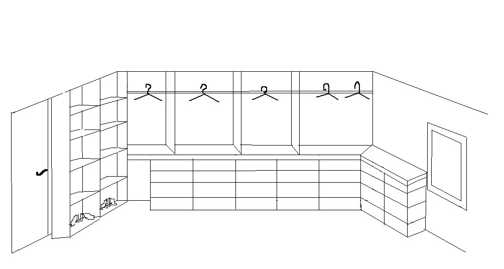

== Introduksjon

Datamaskinen er etter hvert blitt en kompleks maskin bestående av flere 
milliarder ulike komponenter. En av årsakene til dette er at det har vist seg relativt 
enkelt å stadig lage mer rikholdige datamaskiner med hensyn til de 
komponentene som inngår. Når det derimot kommer til hvordan vi programmerer 
maskinene, har det ikke skjedd en tilsvarende rivende utvikling. Det har riktig nok 
vært en utvikling på dette området også, men vi kan ikke si at den har 
vært like stor. 

=== Hvorfor akkurat _C_

Siden 1970-tallet har programmeringsspråket _C_ vært en av bærebjelkene når det 
kommer til det å lage programvare. For eksempel er de mest sentrale delene i de 
fleste operativsystemene (e.g. Windows, Linux, Mac OS X) laget 
i C. Android som svært 
mange har et, bokstavelig talt, nært forhold til, består også hovedsakelig av 
_C_-kode. I tillegg benyttes hovedsakelig _C_ når det kommer til _embeddet systems_, 
det vil si alle de små datamaskinene som du finner i biler, motorsykler, traktorer, vaskemaskiner etc.

En årsak til at programmerignsspråket _C_ er så mye anvendt, kan være at dette spåket 
gir en tilsynelatende optimal abstraksjon inn mot sentrale komponenter i en 
datamaskinen. _C_ benyttes til å lage kode for alt fra små sykkel-computere til 
store datasystem som beregner været, eller installasjoner som sendes ut i verdensrommet. 

Derfor er det vel anvendt tid å lære seg å programere i _C_. _C_ er også et enkelt 
språk å lære seg og etter at du har lært deg litt _C_, vil det være mye lettere å 
forstå tankegangen bak en rekke andre programmeringsspråk som finnes der ute.

=== Hva er en datamaskin
Som nevnt kan en datamaskin være alt fra den 8-bits datamaskinen som gjemmer seg 
inne i sykkel-computeren din, til svære distribuerte datasystemer hvor de ulike 
delene befinner seg på flere steder rundt om i verden. 

Vi skal definere datamaskinen slik vi ser den som en _C_ -programmerer som lager 
et dataprogram for en datamaskin som har et operativsystem. Sagt på en annen måte; som en 
C-programmerer som lager et program for Linux, Windows, Mac eller Android.

Den enkleste modellen vi da kan komme opp med, er et system som bastert på noe 
input, utfører en beregning som presenteres på en eller annen output-enhet.
  
--  
 input -> compute -> output
--

En datamaskin kan ikke finne på noe helt av seg selv. Alt som presenteres, for 
eksempel som tekst på en skjerm, er basert på at det er gjort en eller flere 
beregninger på noe data som er gitt som input. Vi kan som nevnt derfor sammenligne 
et dataprogram med en matematisk funksjon, som for eksempel denne:

--
 f(x) = x² + 2
-- 

Her er x input, f(x) er output, og selve beregningen er x² + 2.

--
 input --> compute --> output
 x --> x² + 2 --> f(x)
 1 --> 1² + 2 --> 3
--

En annen måte å se på det å programmere kan være å si at det å programmere er 
å endre på data. Vi plasserer data i ulike beholdere, gjerne 
kalt variabler, og programmet vi lager manipulerer på innholdet i disse 
beholderne. Vi kan med andre ord se på variablen x ovenfor som en beholder 
hvor vi plasserer tallet 1 og deretter utfører ei beregning basert på 
formelen x^2+2 og får til slutt ut svaret 3, som vi igjen plasserer i beholderen 
som vi kaller for f(x).

Gitt denne metaforen kan vi kanskje se på datamaskinen som ei stor bokhylle, 
med mange ulike bokser eller esker, hvor vi kan plassere data. 

Tenk deg en boks hvor du kan lagre et heltall mellom 1 og 100. I denne boksen 
legger du tallet 15. Deretter lager du et dataprogram som øker dette tallet 
med 5. Hva blir da verdien på tallet i boksen? 

--
 Boks b
 b = 15
 b = b + 5
 Vis verdien til b på skjermen. (b er nå lik 20)
-- 

Det som gjør det hele kompleks, er at det finnes mange ulike bokser og uendelig 
mange muligheter når det kommer til hvordan vi kan endre innholdet i disse. 

Skal du lage en enkel kalkulator som øker verdien til et tall med 5, så holder 
det kanskje med en boks som kan lagre heltall mellom 1 og 100. Men skal du for 
eksempel, lage en teksteditor må du ha en boks som kan lagre tekst. Det finnes 
mange ulike behov som gjør at vi lager oss mange ulike boksen eller variabler. 
Men, prinsippet er det samme; vi oppretter noe data i en eller flere variabler, 
for deretter å endre på innholdet i disse ved hjelp av et dataprogram. 

Det at vi bruker begrepet boks eller variabel, på den beholderen som lagrer den 
informasjonen vi ønsker å endre på, kaller vi for en abstraksjon. Egentlig ligger 
informasjonen i ulike registre inne i datamaskinen, som igjen er bygd opp av 
transistorer, som vi denne sammenhengen kan se på som små brytere som enten er 
på eller av; 1 eller 0. Igjen har vi det at egentlig så er ikke dette så 
vanskelig å forstå. Men, størrelseorden med hensyn til antallet slike brytere, 
og kompleksiteten med hensyn til hvordan de er satt sammen, er av en slik art 
at det neppe finnes en enkeltperson som har den fulle og hele oversikten. 

En datamaskin er en kompleks sammenstilling av mange små komponenter, og vi 
konstruere oss ulike abstraksjoner og forenklinger for å klare å forstå hva som skjer. 

Og som nevnt, en årsak til at C er et populært programmeringsspråk, kan være at 
nettopp dette språket har en tilsynelatende optimal abstraksjon inn mot selve 
datamaskinen. På mange måter kan vi si at beviset på dette ligger i muligheten 
til å lage et dataprogram i C,  som du kan få til å kjøre på mange ulike 
datamaskiner. C er også et kjekt programmeringsspråk å lære seg når man ønsker å 
lære mest mulig rundt hvordan en datamaskin egentlig fungerer. Sagt på en annen måte; 
C har et lavere abstrasjonsnivå inn mot selve datamaskinen, enn en rekke andre språk. Dette
er bra i noen sammenhenger, og ikke fullt så bra i andre. I vår sammenheng, hvor 
vi skal lære grunnleggende ferdigheter rundt det å programmere en datamaskin, mener jeg
dette er bra.
