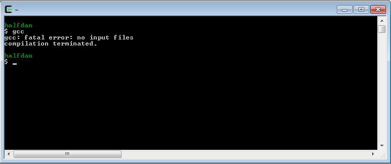

== Kom i gang

Nå er det på tide å begynne med praktisk arbeid. Som nevnt; det å 
programmere er på sett og vis et handtverk. Det kan langt på vei, kun læres  
ved praktisk arbeid. Derfor må vi aller først installere en teksteditor, som 
gjør det mulig å skrive _C_-kode. Deretter skal vi installere en kompilator, som 
kan omgjøre _C_-koden til et kjørbart dataprogram. Når det er gjort, skal vi 
kode det obligatoriske _"Hello World"_-eksempelet, som skriver ut teksten; 
_"Hello world"_ på skjermen.

.Læringsmål
----
 - installere en egnet teksteditor
 - installere en egnet kompilator
 - kode, kompilere og kjøre det obligatoriske "Hello World" -eksempelet
----

For å ta det siste først, så er det slik at alle lærebøker i _C_ må 
starte med et eksempel som skriver ut teksten "Hello World" på skjermen. Slik er 
det bare. (Den historiske forklaringa til dette er at den opprinnelig 
læreboka i _C_ gjør nettop det.)

Så, derfor, her er det:

[source,c]  
.test.c (eksempel 1)
---- 
#include <stdio.h> #<1>

int main (int argc, char *argv[]) { #<2>

    printf("Hello world!\n"); #<3>
    
    return 0; #<4>
    
}
----
<1> Inkluderer litt kode som blant annet definerer funksjonen printf().
<2> Her starter vårt program, i.e. main-funksjonen.
<3> Her skriver vi 'Hello World!' ut på skjermen vha funksjonen printf().
<4> Her returnerer vi verdien null til operativsystemet, som startet vårt program.

Vi skal ganske snart gå gjennom dette eksempelet i detalj, men før vi kommer så 
langt, skal vi _sette opp et uviklingsmiljø_. Vårt utviklingsmiljø vil primært 
bestå av to programmer; en teksteditor og en kompilator. I utgangspunktet 
er det nesten det samme hvilken teksteditor og _C_-kompilator du velger 
å bruke. Alle eksemplene vi går gjennom, skal være forsøkt  
laget slik at de skal kunne fungere på en rekke ulike datamaskiner; Windows, 
Linux, Mac etc. Jeg velger likevel å fokusere på Windows, siden jeg antar at de 
fleste bruker en slik datamaskin. 

Når det gjelder Windows, er det mange ulike alternativer å velge mellom, 
både når det gjelder valg av teksteditor og valg av kompilator. Jeg velger å bruke Cygwin. 
Cygwin er en rekke små program som gjør det mulig å simulere et Linux-miljø på en Windows-maskin. 
Deriblant også et utviklingsmiljø for _C_, i form at en 
kompilator kalt _gcc_. Utover selve kompilatoren innholder Cygwin også et 
skall eller terminalvindu, hvor vi kan kjøre _gcc_-programmet.

=== Slik installerer du Cygwin gcc

Installering av Cygwin fungerer slik, at du starter et program som heter _setup-x86.exe_ 
footnote:[Du kan velge mellom 32 eller 64 bit's installasjon. Jeg velger 32 ]. 
Ved hjelp av dette programmet velger du hvilke programpakker du ønsker å 
installere. Hovedbildet til Cygwin, hvor du velger de ulike pakkene, er vist nedenfor.

Skriv gcc i søkefeltet, som vist. Sjekk om pakken _gcc-core_ er valgt, under _Devel_.
Gcc er en fundamental del i et hvert Linux-lignende system, derfor vil  
gcc-core ganske sikkert allerede være valgt. Men, om så ikke skulle være tilfelle, velger 
du denne, og trykker på neste-knappen helt til _setup wizarden_ er ferdig.

Om alle gode krefter er med oss, skal vi ende opp med noe slikt som dette:

Her har jeg åpnet et cygwin terminalvindu, og skrevet inn kommandoen; *gcc*.
Gcc er verdt en liten studie i seg selv, for å si det forsiktig. Bokstavene gcc  
er et akronym for "gnu c compiler" footnote:[ The abbreviation GCC
has multiple meanings in common use.  The current official meaning is “GNU Compiler Collection”, which refers generically to the complete suite of tools.
The name historically stood for “GNU C Compiler”, and this usage is still common when
the emphasis is on compiling C programs.  Finally,  the name is also used when speaking
of the
language-independent
component of GCC: code shared among the compilers for all
supported languages. For mer informasjon, se gcc.gnu.org], hvor gnu igjen er et såkalt rekursivt akronym for _GNU is Not Unix_.

For å kompilere et _C_-programm ved hjelp av gcc, skriver du i utgangspunktet bare gcc, 
samt navnet på den tekstfila som inneholder din _C_-kode, slik:
 
  gcc test.c
  
gcc vil da produsere ei fil som heter _a.exe_. 
Dette programmet kan du starte ved å skrive:

 ./a.exe

Vi kommer snart tilbake til dette når vi skal skrive vårt obligatoriske _Hello World_ -program. 
Men, før vi får skrevet vårt første _C_-program, må vi installere en god teksteditor. Vi kunne brukt Windows Notepad, 
men går heller for en litt mer pimpa editor, kalt _Notepad++_. (Uttales Notepad-pluss-pluss.) 
 
=== Slik installerer du Notepad++

Notepad-pluss-pluss har etterhvert utviklet seg til å bli kanskje den beste generelle teksteditoren 
som er å oppdrive for Windows? I tillegg er den, som kompilatoren gcc, helt gratis å laste ned og bruke.
Du finner _Notepad-pluss-pluss_ her:

 https://notepad-plus-plus.org/
 
Om alle gode krefter fortsatt er med oss, skal vi ende opp med noe som ligner dette her:

Som du ser, jeg har jeg tastet inn "Hello World" -eksempelet som vi kjenner 
litt fra før. 

Jeg lagrer denne teksten i ei fil, som jeg kaller for _test.c_ 

Fila plasserer jeg her: 

 c:\cygwin\home\halftan\src\cprg\cprogramming\eksempel1\ 

Legg merke til at hjemmekatalogen min, på mitt Cygwin-system, er: 

 c:\cygwin\home\halftan\

Du kan godt lagre din _test.c_ -fil rett på din hjemmekatalog. Deretter åpnet du et 
cygwin-terminalvindu og skriver inn kommandoen som kompilerer tekstfila _test.c_, og gjør den 
om til ei kjørbar binærfil, kalt _a.exe_ Tilslutt skriver du _./a.exe_ for å kjøre programmet som du 
nettopp har laget. 

Om vi ha litt flaks, skal du se at teksten _"Hello World"_, dukker opp i terminalvinduet, og vips; du har laget ditt første dataprogram!
 
 
 
Alle eksemplene som vi skal gå gjennom, eksisterer allerede som tekstfiler. Disse finner du her:

 https://github.com/halftanolger/cprogrammering

Git og github er også verdt et lite studium i seg selv. Her bruker jeg github 
som en lagringsplass for dette bokprosjektet, deriblant all eksempelkoden. Om du 
ønsker _å sjekke ut_ alle eksemplene fra denne lagringsplassen, kan du 
gjøre det slik:

 mkdir src #<1>
 cd src #<2>
 git clone https://github.com/halftanolger/cprogrammering #<3>
 
<1> Opprett en katalog som heter src
<2> Gå ned i denne katalogen
<3> Hent _cprogrammering_ fra github
 
Prøv deretter å utfør:

 cd cprogrammering
 cd eksempel1
 cat test.c 
 
Da skal du forhåpentligvis se dette i terminalviduet ditt:
 
 

På samme måte som i sted, kan du nå skrive _gcc test.c_ for å kompilere _C_-koden om til et 
kjørpart dataprogram, som skriver ut teksten _"Hello world"_ på skjermen.

Da er vi i gang! Vi har installert og fått prøvd, alle verktøyene vi trenger for å 
programmere i C. Nå er det bare å begynne å bruke språket. 