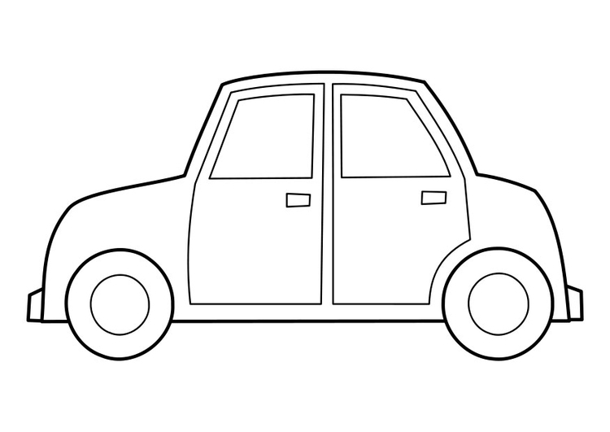

[glossary]
== Ordliste

Her er ei samling ord og uttrykk som vi i større eller mindre 
grad, må kjenne til når vi skal uvikle programvare. Mange av disse 
begrepene må modnes, og på en måte jobbes inn, for å få en 
forståelse av hva de egentlig betyr. Derfor velger jeg å definere disse i et eget 
kaptillet som heter _ordliste_. På den måten blir det lett å komme tilbake 
og se nærmere på et eller flere begrep, når du jobber deg gjennom boka.

[glossary]
Abstraksjon::
    På en måte kan vi si at alt som har med programmering å gjøre har med 
    det å abstrahere. _Wikionary_ definerer det å abstrahere som det _å trekke fram 
    visse vesentlige egenskaper ved noe, og se bort fra andre mer uvesentlige_. Når man
    abstrahere noe, kan man gjøre det av ulik grad, eller på ulike nivå. Når to 
    programmerere skal diskutere ei problemstilling, er det viktig at de er på 
    samme abstraksjonsnivå. Dette gjelder vel egentlig i alle livets aspekter, men når 
    vi lager programmvare må vi i alle fall være bevist på at vi forenkler 
    virkeligheten i den hensikt å kunne forstå og løse ei problemstilling. Og at vi 
    forenkler den i ulik grad, avhening av hvor vi er i prossessen.

Modell::
  Det å abstrahere er bokstavelig talt, et abstrakt begrep. I prosessen å bevege 
  seg fra en abstrakt tanke frem til ei konkret løsning, innfører vi begrepet; _en modell_. 
  _Wikionary_ definerer en modell i denne sammenhengen, som en _forenklet beskrivelse, figur 
  eller fysisk objekt laget for å forklare og fremheve hvordan noe fungerer_. Jeg 
  skal prøve å konkretisere dette med et eksempel. Tenk deg en bil. Hvordan skal vi 
  beskrive denne? Hva består den av; hva er de viktigste bestanddelene? En måte å 
  gi svar på disse spørsmålene, er ved å lage en modell, for eksempel i form av ei
  skisse. Vi kunne også laget denne modellen i form av ei liste, som 
  vi for eksempel kunne kalle for _bil_. Elementene i denne lista kunne for 
  eksempel være; fire dører, fire hjul, to støtfangere. Legg merke til at med en gang 
  vi lager en modell av noe, så forenkler vi virkeligheten. Vi gjør automatisk en 
  seleksjon i det vi velger oss ut noen atributter eller egenskaper, som vi tror 
  er viktigst. Men, vi har i alle fall begynt prosessen i det å konkretisere ei 
  løsning på ei problemstilling. Nedenfor ser vi to ulike modeller av en bil; ei tegning 
  og ei liste.
  

--
 bil: fire dører, fire hjul, to støtfangere
--

Programmeringsspråk::
  En vanlig datamaskin er bygd opp av mange milliarder transistorer. Disse er satt 
  sammen til ulike logiske kretser som kan programmeres ved hjelp av noe som heter 
  et maskinspråk eller maskinkode. Når vi skal lage vårt dataprogram, så skal vi 
  bruke et programmeringsspråk, som på en eller annen måte, ender opp til å bli slik 
  maskinkode. Hvordan dette skjer, er så pass komplekst, at vi velger å abstrahere 
  oss litt bort fra det. Vi sier bare at vi definerer dataprogrammet vårt i et 
  programmeringsspråk, som ender opp som maskinkode som igjen styrer de ulike 
  logiske enhetene i datamaskinen. Det er en rekke ulike programmeringsspråk å 
  velge mellom. Hvilke programmeringsspråk som er best, vil variere mellom hvem 
  du spør og hvilket problem du ønsker å løse.
  
Kompilator::
  Vi skal se på et programmeringsspråk som heter _C_. Det vil si at vi skal skrive 
  vanlig _C_-kode, som vanlig tekst, i en vanlig teksteditor, slik mange programmerere 
  har gjort det siden tidlig 1970-tall. Denne _C_-koden, som er vanlig tekst, skal vi 
  kompilere om til maskinkode som en datamaskin kan forstå og bruke. Det som er litt 
  bra med _C_-kode, er at slik kode kan omgjøres til nærmest en hvilken som helst 
  maskinkode på nærmest en hvilken som helst datamaskin. Det som er poenget her, er 
  at prosessen i å omgjøre ei vanlig tekstfil med kode, om til maskinkode, kalles å 
  kompilere. Og for å kompilere bruker vi en kompilator.   _Wikionary_ definerer ordet 
  kompilator slik: _et dataprogram som oversetter – kompilerer – et dataprogram skrevet 
  i et programmeringsspråk (kalt kildekode) til et kjørbart program (maskinkode). 
  Dette kan sammenlignes med å være tolk for to personer som snakker forskjellig språk; 
  tolken oversetter det den ene sier, slik at den andre personen klarer å dra 
  nytte av – dvs. forstå – informasjonen_.
  
Variabel::
  The corresponding (indented) definition.
  